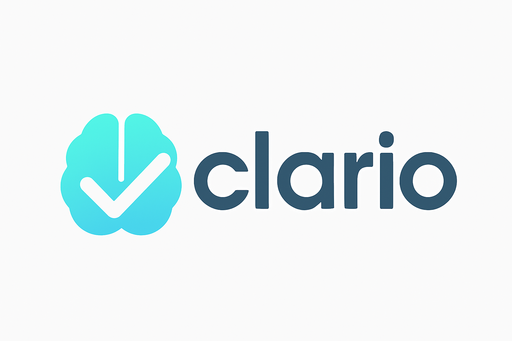
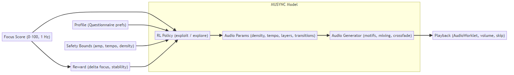

## Clario: Be calm. Stay focused. Perform your best.


An interactive web application that generates adaptive music based on your brain activity using the Muse 2 EEG headband. The music adapts in real-time to your focus levels, creating a unique neurofeedback experience.

Made for the natHACKS 2025 hackathon.

## Overview
Clario helps people with learning disabilities stay focused during demanding work—timed tests, reading assignments, homework blocks, and deep-work sprints. Put on a Muse 2 headset, press Start, and complete a quick one-minute calibration (30 seconds relaxing, 30 seconds mental math). From there, Clario’s MUSYNC (Music Utilizing SYNchronized Cognitive feedback) reads your moment-to-moment focus and shapes the sound so settling in feels easier and distractions feel quieter.

After calibration, a short learning-profile and psychology questionnaire asks about sound sensitivity, distractibility, preferred energy level, and task type. Your answers become a personal listening profile that steers the music. For some people that means steady, predictable rhythm with gentle variation; for others it’s softer dynamics, fewer bright timbres, or slower harmonic movement. You can revise these choices any time, and they stay on your device.

During your session, Clario adapts in real time. When attention drifts, the music nudges you back to your flow state without abrupt changes; when you’re focused, it stays out of the way and remains supportive rather than demanding attention. You stay in control with simple, accessible controls—start/pause, volume, skip—plus a clear focus meter and one‑tap recalibration.

Sessions run locally for privacy; only a single focus value and basic controls are shared with the audio service. If the headset disconnects, playback fades out safely and resumes when you reconnect. Clario isn’t a medical device; it’s a practical study and testing companion that makes focused work calmer, more predictable, and more achievable for people with diverse learning needs.

## MUSYNC Model (Music Utilizing SYNchronized Cognitive feedback)




## Features

- Real-time EEG data processing from Muse 2 headband
- Focus level detection using alpha/beta wave ratios
- Adaptive music generation responding to brain state
- Live visualization of focus metrics
- Calibration system for personalized baseline
- WebSocket-based real-time updates
- Responsive web interface

## Prerequisites

- Python 3.13+
- Node.js (latest LTS recommended)
- Muse 2 EEG headband
- macOS / Windows (for Muse 2 connectivity)

## Installation

### Backend Setup

```bash
# Navigate to backend directory
cd app/backend

# Install Python dependencies
pip install -r requirements.txt
```

### Frontend Setup

```bash
# Navigate to frontend directory
cd app/frontend

# Install Node dependencies
npm install
```

## Development

Run both the backend and frontend development servers:

### 1. Start the Backend

```bash
cd app/backend
uvicorn backend:app --reload --host 127.0.0.1 --port 8000
```

The backend will be available at:
- API: http://127.0.0.1:8000
- WebSocket: ws://127.0.0.1:8000/ws
- Music WebSocket: ws://127.0.0.1:8000/ws/music

### 2. Start the Frontend

In a new terminal:

```bash
cd app/frontend
npm run dev
```

Visit http://localhost:5173 to access the web app in development mode.

## Usage

1. Connect your Muse 2 headband via Bluetooth
2. Open the web application
3. Click "Connect" to establish connection with the headband
4. Follow the calibration process to personalize focus detection
5. Start the music session and experience adaptive audio

## Project Structure

```
app/
  backend/                 # FastAPI backend
    backend.py             # Main server + EEG processing
    rl_music.py            # Music generation service
  frontend/                # React/Vite frontend
    src/                   # Frontend source code
    public/                # Static assets
docs/
  stack-diagram-banner.mmd # Wide README diagram (source)
  stack-diagram-banner.svg # Wide README diagram (SVG)
```

## Troubleshooting

- Ensure Muse 2 is charged and in pairing mode
- Check Bluetooth connectivity
- Verify port 8000 is available
- For connection issues, try restarting the headband
- Frontend dev server needs VITE_API_URL if using different backend port

## Contributing

1. Fork the repository
2. Create your feature branch (`git checkout -b feature/AmazingFeature`)
3. Commit your changes (`git commit -m 'Add some AmazingFeature'`)
4. Push to the branch (`git push origin feature/AmazingFeature`)
5. Open a Pull Request

## Contributors

- Megh Mistry
- Nithesh Liyanaarachchi
- Kulgagan Bajwa
- Umar Kiani
- Mohammad Naqvi
- Vladislav Marchenko

## References

 - <a href="https://pmc.ncbi.nlm.nih.gov/articles/PMC10221503/">https://pmc.ncbi.nlm.nih.gov/articles/PMC10221503/</a>
