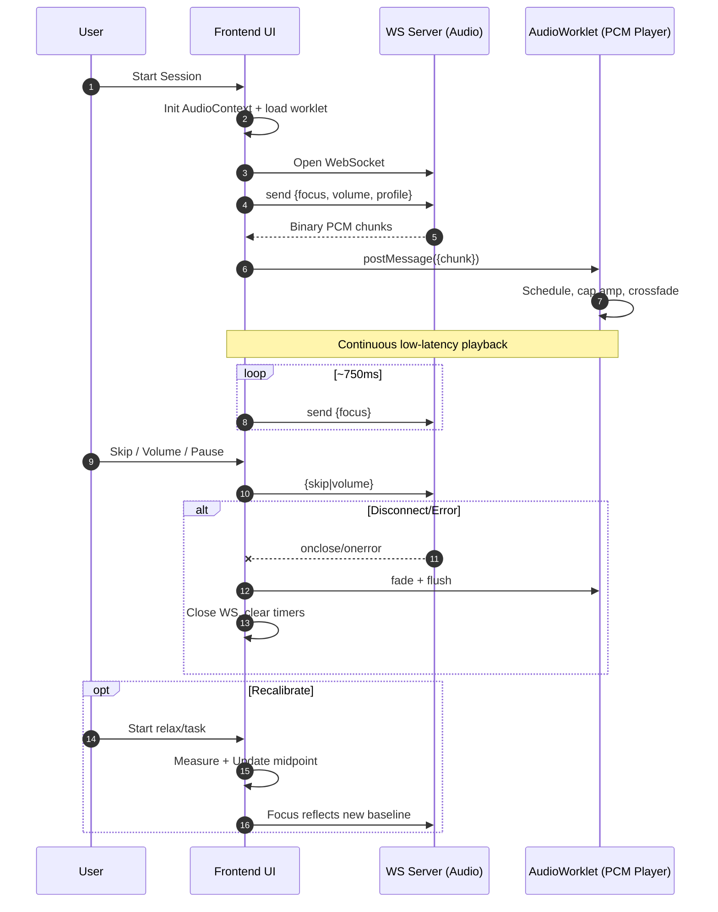

# MUSYNC Diagrams

This page contains the end-to-end pipeline and the runtime sequence for the app.

```mermaid
%% Pipeline (flowchart)
flowchart TD
  A[User Opens App] --> B[Connect & Permissions\nMuse 2 + Audio]
  B --> C[Calibration\nRelax → Task → Midpoint]
  C --> D[EEG Ingest & Features\nFilter + Artifact Gate + Bands]
  D --> E[Cognitive State\nAlpha/Beta → Focus %\nSmoothing]
  E --> F[Policy & Feedback\nKeep + Explore + Transition\nAdjust params]
  F --> G[Generation & Mixing\nMotif/Params + Crossfade]
  G --> H[Transport\nWebSocket PCM chunks]
  H --> I[Playback\nAudioWorklet + Volume + Skip]
  I -->|Focus updates (0-100)| E
  I --> J[UI & Controls\nDashboard, Calibration, Quiz]
  J --> F

  subgraph Personalization
    Q[Questionnaire\nProfile + Overrides] --> F
  end

  subgraph Safety & Telemetry
    S1[Latency guards + Underruns] --> H
    S2[Fade/flush on disconnect] --> I
    S3[Errors & metrics] --> J
  end
```



Exports
- Source files: `docs/musync-flow.mmd`, `docs/musync-sequence.mmd`.
- To export PNG/SVG, use the scripts in `app/frontend/package.json` (see below) or one-off `npx @mermaid-js/mermaid-cli` commands.

